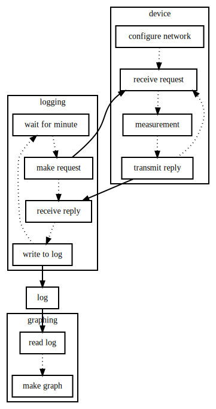

# Desk Temperature Device

When starting a new job, it can be difficult to figure out what actions should be taken to be comfortable.  A quick hack to gather data from the office environment uses an Adafruit ESP8266 Feather, placed in various locations, with data gathered by a computer over Wi-Fi.

## Hardware

* [Adafruit ESP8266 Feather](https://www.adafruit.com/product/2821), with ESP-12 module, thanks to [Little Bird Electronics](https://littlebirdelectronics.com.au/products/adafruit-feather-huzzah-with-esp8266-wifi),
* a DS18B20 temperature sensor, with 4k7 pull-up resistor,

## Software

* on the device, MicroPython, with a boot script,
* on the computer, Python, with a data logging script,
* on the computer, gnuplot, for graphing the data.

## Diagram

----
